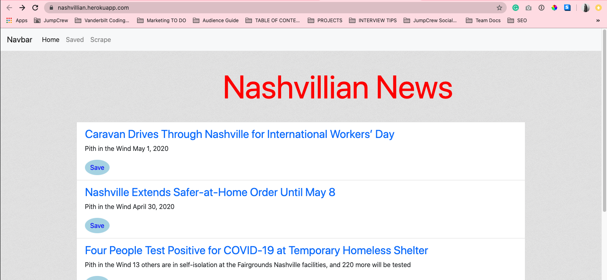

Nashvillian News is an app that shows the top news stories relevant to those local to Nashville.

Technologies used:
- Express
- Express-handlebars
- Mongoose
- Cheerio
- Axios
- Bootstrap

Deployed Heroku link: https://nashvillian.herokuapp.com/

How It Works:

1. Scrape
- Click the scrape button.

2. Home
- Click "back" in your browser to go back to home after the the news has been scraped.

3. Save
- Browse the articles and "Save" any that you would like to keep. They will dissapear as you click "Save" and move to the "Saved" tab.

4. Saved
- Click on the "Saved" tab to see the articles you've saved. 

5. Remove
- When you're done reading and referencing your saved articles, you can "Remove" them from the "Saved" section. 

Ice box items:
- Center title
- Style the page
- Remove comment/note box
- Remove the "Navbar" from the Navbar
- Add other local news sites to scrape from